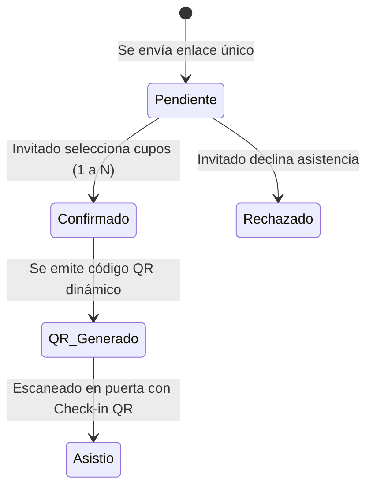

# Sistema RSVP Inteligente

## Definición
El **Sistema RSVP Inteligente** es un módulo de gestión de asistencia digital parametrizado que permite a los anfitriones de un evento controlar de forma estricta e individualizada la confirmación de sus invitados, evitando el desborde de cupos y las transferencias ilegítimas de pases.

## Problemas que Resuelve
1. **Reenvíos no autorizados**: Al utilizar identificadores únicos cifrados por enlace (ej. `/invitacion/xyz123`), el sistema asocia la invitación a una única familia o persona.
2. **Exceso de acompañantes**: El selector de asistencia limita numéricamente los pases al número asignado por el anfitrión (ej. *"Confirmar hasta 2 de 2 pases"*).
3. **Incertidumbre de mesas**: Permite informar al invitado de forma discreta qué número de mesa le corresponde.

## Flujo de Estados

## Integraciones Clave
- **Emisión de Tickets**: Genera automáticamente el [[checkin-qr]] una vez confirmada la presencia.
- **Live Dashboard**: Alimenta en tiempo real las métricas del anfitrión.
- **Diferenciación de Planes**: Disponible en su máxima expresión en el Plan Imperial de [[festejia]].

## Enlaces Relacionados
- [[checkin-qr]]
- [[festejia-sistemas-tecnologia]]
- [[modelo-comercial-festejia]]
