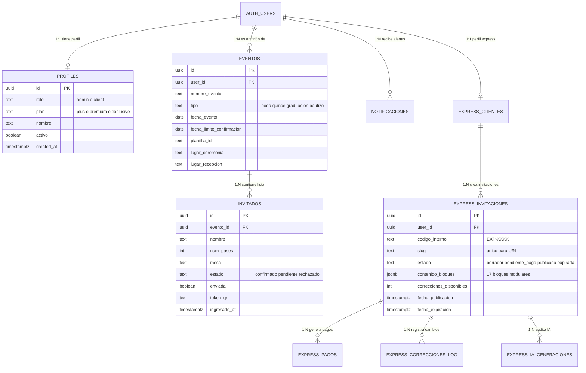

# Arquitectura de Backend y Esquema Relacional de Base de Datos (Supabase / PostgreSQL)

Este documento consolidado describe el diseño completo de la base de datos relacional de [[festejia]], integrando los módulos de **Invitaciones Bespoke de Alta Gama** y el ecosistema **Festejia Express**.

---

## 1. Diagrama Entidad-Relación Consolidado

---

## 2. Tablas del Módulo Bespoke (Clásico, Elegante, Imperial)

### 1. `profiles`
- Extiende la tabla nativa `auth.users`.
- `role`: `'admin'` (acceso a `/admin` y `/admin-express`) o `'client'` (anfitriones).
- `plan`: `'plus'` (Clásico, max 50), `'premium'` (Elegante, max 150), `'exclusive'` (Imperial, ilimitado 9999).
- `activo`: booleano para habilitar o suspender el acceso del anfitrión.

### 2. `eventos`
- Define el evento central gestionado por el cliente.
- Contiene nombres de novios/agasajados, lugares, horarios, enlaces de mapas y plantilla asignada (`plantilla1`, `plantilla2`).

### 3. `invitados`
- Registros individuales de cada familia o persona invitada.
- Protegida por el trigger [[triggers-postgresql-supabase|validar_limite_invitados_por_plan]].
- Columnas de control: `num_pases`, `mesa`, `estado`, `enviada` (boolean) y `token_qr` con formato `festejia:UUID`.
- Columna `ingresado_at`: marca de tiempo registrada en puerta mediante [[checkin-qr]].

### 4. `notificaciones`
- Tabla para alertas y recordatorios proactivos ([[motor-notificaciones-hitos]]).
- Suscripción en tiempo real WebSocket en el canal `notif-[user.id]`.

---

## 3. Tablas del Módulo Festejia Express (SaaS DIY)

### 1. `express_clientes`
- Vincula al usuario de Auth con sus datos de contacto y teléfono de WhatsApp.

### 2. `express_invitaciones`
- Almacena el estado completo de la invitación.
- Columna `contenido_bloques` en formato **JSONB**: contiene la jerarquía y valores de [[los-17-bloques-express]].
- Columnas sincronizadas automáticamente por `sync.js`: `nombre1`, `nombre2`, `fecha_evento`, `ceremonia_lugar`, `recepcion_lugar`, `dresscode`.
- `correcciones_disponibles`: contador inicializado en 2 tras la compra.

### 3. `express_pagos`
- Historial de transacciones de publicación (Bs. 200) o correcciones extra (Bs. 30).
- Campos: `monto`, `tipo`, `estado` (`pendiente`, `confirmado`, `rechazado`), `admin_id` y marcas temporales.

### 4. `express_correcciones_log`
- Registro inmutable que almacena la fecha, el usuario y los campos modificados en cada edición post-publicación.

### 5. `express_ia_generaciones`
- Auditoría del microservicio de inteligencia artificial ([[seguridad-ia-kimi-moonshot]]) con limitación de 40 llamadas por hora.

---

## Enlaces Relacionados
- [[triggers-postgresql-supabase]]
- [[motor-notificaciones-hitos]]
- [[festejia-especificacion-panel-admin]]
- [[festejia-especificacion-panel-cliente]]
- [[festejia-guia-desarrollo-web]]
