# Hoja de Ruta de Pasarelas de Pago para Bolivia e Internacional

Este documento sintetiza la estrategia financiera y técnica de [[festejia]] para el cobro de invitaciones tanto en el mercado local boliviano como en el mercado internacional, maximizando la tasa de conversión y minimizando costes de intermediación.

---

## 1. El Reto Financiero en Bolivia
- **Brecha Cambiaria**: Aplicación estricta de la [[politica-cambiaria-mercado]] a **11.50 BOB/USD**.
- **Preferencia por QR**: El consumidor boliviano prefiere pagar mediante el estándar **QR Simple Billetera Móvil (interbancario)** antes que ingresar datos de tarjeta de crédito en pasarelas web desconocidas.

---

## 2. Las Tres Fases de Implementación en Bolivia

```mermaid
flowchart TD
    subgraph FASE_1["Fase 1: Vigente (Cero Comisión)"]
        A1["Cliente pulsa 'Pagar'"] --> B1["Abre WhatsApp con código EXP-XXXX"]
        B1 --> C1["Cliente envía comprobante de QR Simple"]
        C1 --> D1["Admin verifica en /admin-express y aprueba"]
    end

    subgraph FASE_2["Fase 2: Enlaces Dinámicos Libélula"]
        A2["Cliente pulsa 'Pagar'"] --> B2["Generación de link de cobro Libélula"]
        B2 --> C2["Pago con Tarjeta de Débito / QR Dinámico"]
        C2 --> D2["Comprobante automático vía Webhook parcial"]
    end

    subgraph FASE_3["Fase 3: Automatización Total API REST"]
        A3["Cliente completa pago en pasarela"] --> B3["Webhook de Libélula golpea /api/payments/webhook"]
        B3 --> C3["Trigger de BD cambia estado a 'publicada' en 500ms"]
        C3 --> D3["Invitación activa sin intervención humana"]
    end

    FASE_1 --> FASE_2 --> FASE_3
```

### Detalle por Fase:

#### Fase 1: Manual Asistida (Actual)
- **Ventaja**: 0% de comisiones por pasarela; contacto personal que permite ofrecer servicios adicionales ([[addons-servicios-adicionales]]).
- **Herramienta**: Panel `/admin-express` ([[festejia-especificacion-panel-admin]]).

#### Fase 2: Enlaces Dinámicos con Libélula
- Integración de SDK ligero de Libélula para cobrar montos fijos de Bs. 200 (Express) o seña de Bs. 170 (Bespoke).
- Reduce la carga operativa de verificar transferencias bancarias en fines de semana.

#### Fase 3: Integración Nativa API REST
- Microservicio en `app/api/webhooks/libelula/route.js`.
- Actualización transaccional con firma criptográfica HMAC para evitar comprobantes falsificados.

---

## 3. Canales de Cobro Internacional
Para clientes en el resto de América Latina, EE.UU. y Europa:
- **PayPal**: Cobro en USD a cuenta corporativa.
- **Tarjetas Internacionales**: Procesamiento directo.
- **Criptomonedas / Dólar Digital**: Cobro en **Binance (USDT/USDC)** mediante red BEP20 o TRC20, ideal para anfitriones que viven en el extranjero o en países con restricciones cambiarias (Argentina, Venezuela).

---

## Enlaces Relacionados
- [[politica-cambiaria-mercado]]
- [[modelo-comercial-festejia]]
- [[festejia-especificacion-panel-admin]]
- [[festejia-arquitectura-backend-base-datos]]
